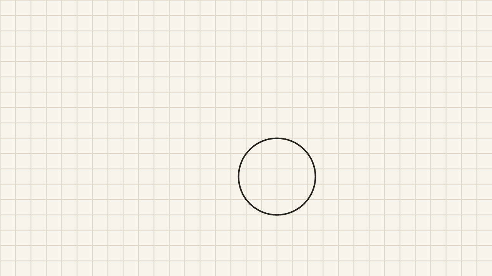


- [一、快速开始](quick-start.md)
- [二、安装与升级](installation.md)
- [三、站点配置](configuration.md)
- **四、写作**（当前篇）
- [五、短代码参考](shortcodes.md)
- [六、自定义](customization.md)
- [七、部署](deployment.md)
- [八、常见问题](troubleshooting.md)
- [九、设计理念](design.md)
- [十、许可](licenses.md)


这一篇讲**怎么写正文**：文章头部的字段、图片放哪、公式和代码怎么写、各类 markdown 元素在主题里长什么样。

每处都按同一个格式来：**先给写法（代码块），再给效果（渲染结果）**，两者一一对应，可以照着抄。

折叠块、二维码、视频音频那些**短代码**另开一篇，见[短代码参考](shortcodes.md)。

## front matter 字段

一篇文章的头部是 YAML 格式，夹在两条 `---` 之间：

```yaml
---
title: "文章标题"
date: 2026-09-10T10:00:00+08:00
tags:
  - 排版
categories:
  - 随笔
description: "一句话摘要，会用作 meta description 与分享卡片描述"
cover: "assets/cover.jpg"
draft: false
---
```

| 字段 | 必填 | 作用 |
|---|---|---|
| `title` | 是 | 标题。同时用于首页卡片、归档目录、页面 `<title>` |
| `date` | 建议写 | 归档按它分年月；**不写日期或写成未来时间，文章不会出现在归档里** |
| `tags` / `categories` | 否 | 分类法。标签渲染成印谱、分类渲染成书架，见[站点配置](configuration.md) |
| `description` | 否 | 覆盖 meta description；不写就用正文自动摘要 |
| `cover` | 否 | 首页卡片右下角的印记换成自己的图（写文章 `assets/` 下的文件名，如 `assets/cover.jpg`），同时作为分享卡片的 `og:image` |
| `draft` | 否 | `true` 时不渲染，需要 `hugo server -D` 才看得到 |

> **日期写成了未来时间，文章会「消失」**——Hugo 默认不渲染未来日期的内容。这是最容易自己吓自己的一条。

## 图片：放在文章的 assets/ 里（page bundle）

一篇文章连同它的图片放进同一个文件夹，这就是 Hugo 的 **page bundle**。图片统一收进它下面的 `assets/`——文章目录里就只剩一个 `index.md` 和一个文件夹，图多了也不会糊成一片：

```
content/posts/my-post/
├── index.md
└── assets/
    ├── photo.jpg
    └── cover.jpg
```

正文写 ``，front matter 的 `cover` 也写 `assets/cover.jpg`（都是**相对文章目录**的路径）。构建时自动做三件事：

- 压缩并转 **WebP**，生成三档**响应式 srcset** + 懒加载
- 每张图包一层指向最大档的链接——点图进入**图窗**（放大镜浏览，见[设计理念](design.md)）
- 图窗里的**题跋图注**：`title` 有就用 `title`，没有则退回 `alt`

**写法**（第一张带图注、第二张只有 alt）：

```markdown



```

**效果**：


**不要把图片放到外部图床**——图片和文章在同一个 Git 仓库里，是本主题和整个博客架构的根基约定（本地所见即所得、整站可镜像）。远端的图（HTTP 图）不会被压缩管线处理，只按原图展示。

## 公式：构建期渲染

公式用 goldmark passthrough 的定界符，在**构建期**被 KaTeX 渲染成静态 HTML（客户端不加载任何脚本）。定界符三种：

| 用途 | 定界符 |
|---|---|
| 行内 | `\( ... \)` |
| 块级 | `\[ ... \]` |
| 块级 | `$$ ... $$` |

**行内**，与中文正文基线自然对齐：

```markdown
质能方程 \(E = mc^2\) 是行内公式；欧拉恒等式 \(e^{i\pi} + 1 = 0\) 常被称为最优美的公式。
```

质能方程 \(E = mc^2\) 是行内公式；欧拉恒等式 \(e^{i\pi} + 1 = 0\) 常被称为最优美的公式。

**块级**用 `$$`：

```markdown
$$
\int_{-\infty}^{\infty} e^{-x^2} \, dx = \sqrt{\pi}
$$
```

$$
\int_{-\infty}^{\infty} e^{-x^2} \, dx = \sqrt{\pi}
$$

**方括号定界符**完全等价：

```markdown
\[
\lim_{x \to 0} \frac{\sin x}{x} = 1
\]
```

\[
\lim_{x \to 0} \frac{\sin x}{x} = 1
\]

**矩阵**这类需要排版结构的也照常：

```markdown
$$
A = \begin{pmatrix} a_{11} & a_{12} \\ a_{21} & a_{22} \end{pmatrix}, \quad
\det A = a_{11}a_{22} - a_{12}a_{21}
$$
```

$$
A = \begin{pmatrix} a_{11} & a_{12} \\ a_{21} & a_{22} \end{pmatrix}, \quad
\det A = a_{11}a_{22} - a_{12}a_{21}
$$

**和中文混排**是这套方案存在的理由：

```markdown
设墨的浓度为 \(c\)，加水量为 \(w\)，则稀释后的浓度为
$$
c' = \frac{c}{1 + w}
$$
```

设墨的浓度为 \(c\)，加水量为 \(w\)，则稀释后的浓度为

$$
c' = \frac{c}{1 + w}
$$

这套定界符需要在 `hugo.toml` 里开 passthrough（见[站点配置](configuration.md)），**否则公式会以原始 LaTeX 露在页面上**。

## 代码块

代码块是**写法即效果**——围栏里写什么，渲染出来的就是什么，所以不需要单独的写法段。它走 Chroma 高亮，双明暗两套配色（由 CSS 变量驱动，跟随站点明暗），右上角悬停出现复制按钮：

```go
package main

import "fmt"

// Serve 监听在宣纸上
func Serve(addr string) error {
    fmt.Println("listening on", addr)
    return http.ListenAndServe(addr, nil)
}
```

```javascript
const paper = {
  name: '宣纸',
  ink: ['#26241F', '#3A3833', '#8C877B'],
  get feel() {
    return this.ink.length >= 3 ? '舒服' : '太花哨';
  },
};
```

```bash
# 构建纯静态产物
hugo --minify
# 双远端备份
git push origin main && git push mirror main
```

```diff
+ 加一行新的：墨色梯度
- 删一行旧的：花哨的渐变
  保留一行：留白
```

语言标签**完全来自你写的那串标记**，原样显示、不做映射。写 `py` 就显示 `py`；写 `notalang` 这种 Chroma 不认识的语言，**不会有高亮、但标签照常显示**：

```notalang
whatever content here
```

不写语言就什么都不显示：

```
plain block without language tag
```

超长行不会撑破容器，会变成可横向滚动：

```text
这一行故意写得很长很长很长，用来测试横向滚动是否正常工作而不撑破容器，这一行故意写得很长很长很长，用来测试横向滚动是否正常工作而不撑破容器，这一行故意写得很长很长很长。
```

明暗跟随需要 `markup.highlight.noClasses = false`（见[站点配置](configuration.md)）。

## 标题与锚点

- 每个标题渲染时带毛笔圈点记号 + 锚点链接（悬停出现），正文 h1 也有落点朱砂短竖
- 想在标题上写死锚点 ID：`## 小节 {#my-anchor}`（需开 `attribute.block`），见下面「标题属性」
- 右侧目录（TOC）自动生成，带 scrollspy 高亮；条目多于 10 条自动折叠

## Markdown 各类元素的版式

主题对 markdown 的常用元素都有专门版式，不用额外做什么。每个元素都是**先写法、后效果**。

唯一一处**自动判断**的是首字下沉：正文第一段的首字会自动沉两行、垫一枚淡朱印底；但若这第一段铺不满一行（约 47 个汉字以内），构建期会自动跳过下沉——开篇只有一句话时那顶 3em 的帽子会显得很突兀。**不用手动处理**，想让它沉就多写两句。第一段若是折叠块或引用块，下沉不落在它们身上。

### 行内元素

**写法：**

```markdown
**粗体**、*斜体*、~~删除线~~、`行内代码`、[普通链接](https://gohugo.io/)、自动链接 <https://gohugo.io/>，还有 <mark>标记文本</mark>、快捷键 <kbd>Ctrl</kbd> + <kbd>C</kbd>，以及一个 emoji：:+1:

转义测试：\*这不应是斜体\*，\`这不应是代码\`
```

**效果：**

**粗体**、*斜体*、~~删除线~~、`行内代码`、[普通链接](https://gohugo.io/)、自动链接 <https://gohugo.io/>，还有 <mark>标记文本</mark>、快捷键 <kbd>Ctrl</kbd> + <kbd>C</kbd>，以及一个 emoji：:+1:。

转义测试：\*这不应是斜体\*，\`这不应是代码\`。

> `<em>`（`*斜体*`）在中文里渲染成**着重号**而不是斜体——霞鹜文楷没有真正的斜体字面，浏览器合成假斜体在汉字上很脏。这是主题刻意的选择。

### 语义标签与上下标

**写法：**

```markdown
<abbr title="霞鹜文楷">LXGW</abbr> 是正文字体，<small>这是附属说明</small>，书名用 <cite>文心雕龙</cite>，引语用 <q>修辞立其诚</q>，变量写作 <var>count</var>，样例输出 <samp>ok</samp>。

上下标：H<sub>2</sub>O 与 E = mc<sup>2</sup>，两者都不该把行高撑开。
```

**效果：**

<abbr title="霞鹜文楷">LXGW</abbr> 是正文字体，<small>这是附属说明</small>，书名用 <cite>文心雕龙</cite>，引语用 <q>修辞立其诚</q>，变量写作 <var>count</var>，样例输出 <samp>ok</samp>。

上下标：H<sub>2</sub>O 与 E = mc<sup>2</sup>，两者都不该把行高撑开。

这些需要 `markup.goldmark.renderer.unsafe = true`，否则会被转义成文本。

### 定义列表

**写法：**

```markdown
墨阶
: 正文用四档墨色拉开层级：浓墨标题、重墨正文、次档灰褐、最淡的淡墨。

宣纸
: 站点底色取宣纸黄，配 24px 稿纸格纹。
```

**效果：**

墨阶
: 正文用四档墨色拉开层级：浓墨标题、重墨正文、次档灰褐、最淡的淡墨。

宣纸
: 站点底色取宣纸黄，配 24px 稿纸格纹。

### 任务列表

**写法：**

```markdown
- [x] 洗笔
- [x] 研墨
- [ ] 写完这篇博客
- [ ] 等墨干
```

**效果：**

- [x] 洗笔
- [x] 研墨
- [ ] 写完这篇博客
- [ ] 等墨干

### 嵌套列表与引用

**写法：**

```markdown
1. 文房四宝
   1. 笔
      - 兼毫
      - 狼毫
   2. 墨
      > 松烟墨入水有紫光者为上。这句嵌套引用放在列表里试试缩进。
   3. 纸
   4. 砚
2. 茶席四事
```

**效果：**

1. 文房四宝
   1. 笔
      - 兼毫
      - 狼毫
   2. 墨
      > 松烟墨入水有紫光者为上。这句嵌套引用放在列表里试试缩进。
   3. 纸
   4. 砚
2. 茶席四事

引用也可以嵌套，每层左边一条墨色竖线：

**写法：**

```markdown
> 第一层引用。
>
> > 第二层引用，看看缩进和边框颜色。
> >
> > > 第三层——应该没人写这么深，但出现了也不能破版。
```

**效果：**

> 第一层引用。
>
> > 第二层引用，看看缩进和边框颜色。
> >
> > > 第三层——应该没人写这么深，但出现了也不能破版。

### 表格

宽表会自动套一层可横向滚动的容器，不会撑破版心。

**写法：**

```markdown
| 左对齐 | 居中 | 右对齐 |
| :--- | :---: | ---: |
| 松烟墨 | 徽墨 | 油烟墨 |
| 一千 | 二百 | 三十六 |
```

**效果：**

| 左对齐 | 居中 | 右对齐 |
| :--- | :---: | ---: |
| 松烟墨 | 徽墨 | 油烟墨 |
| 一千 | 二百 | 三十六 |

### 脚注

**写法：**

```markdown
宣纸有个很有意思的别名[^yizhi]，古人也叫它「楮先生」[^chusheng]。同一个脚注可以被多次引用[^yizhi]，文末会自动生成脚注区块。

[^yizhi]: 旧说宣纸因「宣州纸」得名，产地在唐属宣州，今安徽泾县。
[^chusheng]: 韩愈《毛颖传》以物拟人，纸被称作「会稽楮先生」。
```

**效果：**

宣纸有个很有意思的别名[^yizhi]，古人也叫它「楮先生」[^chusheng]。同一个脚注可以被多次引用[^yizhi]，文末会自动生成脚注区块，编号可点击跳转。

[^yizhi]: 旧说宣纸因「宣州纸」得名，产地在唐属宣州，今安徽泾县。
[^chusheng]: 韩愈《毛颖传》以物拟人，纸被称作「会稽楮先生」。

### 标题属性

想给标题写死锚点 ID，在标题末尾加 `{#...}`。**写法：**

```markdown
#### 这个标题有自定义锚点 {#custom-anchor}
```

**效果**（源码里的 `{#custom-anchor}` 不会显示，只会变成 `<h2 id="custom-anchor">`——你正看到的这个标题就是它生效的样子）：

#### 这个标题有自定义锚点 {#custom-anchor}

正文里也可以手写 `#` 一级标题，主题给它单独的样式（宋体标题栈、浓墨、比 h2 大一号）：

```markdown
# 这是一个正文一级标题
```

# 这是一个正文一级标题

## 首页卡片的印记（封面）

每张首页卡片右下角有一枚淡印。默认按文章标题哈希自动生成八式水墨小品（远山晓日 / 竹影 / 空亭听雨 / 汀洲孤雁 / 孤舟远影 / 红杏出墙 / 云岫 / 杨柳岸），**同一篇文章永远同一幅**。想换成自己的图，在 front matter 给 `cover`：

```yaml
---
title: "我的文章"
cover: "assets/cover.jpg"   # 文章 assets/ 下的文件名，或以 / 开头的静态图片路径
---
```

自定义图会经图片管线压成 WebP；社交分享的 `og:image` 也取这张 `cover`（裁成 1200×630），没填就用主题默认图（站点在 `static/images/og-default.png` 放一张同名图即可覆盖）。

## 手动指定摘要

首页卡片显示的是 `.Summary`。默认取正文第一段，想手动截断就在那里插一行：

```markdown
这是摘要段，首页卡片只会显示到这里。

<!--more-->

后面的内容不进摘要。
```
